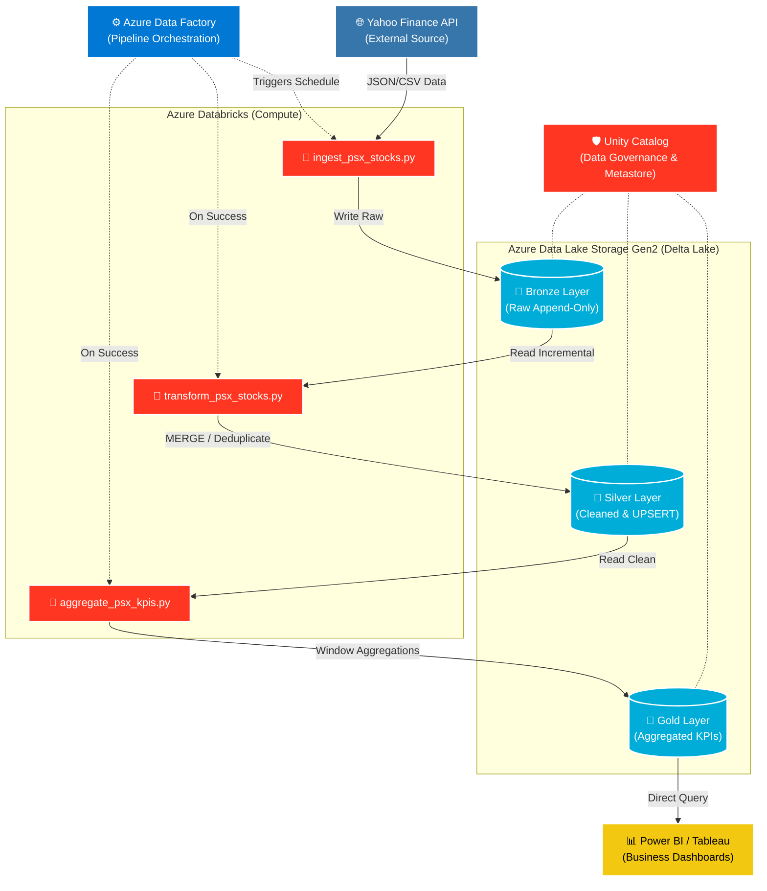

# Pipeline Architecture

```mermaid
graph TD
    %% Styling
    classDef azure fill:#0078D4,stroke:#fff,stroke-width:2px,color:#fff;
    classDef databricks fill:#FF3621,stroke:#fff,stroke-width:2px,color:#fff;
    classDef api fill:#3776AB,stroke:#fff,stroke-width:2px,color:#fff;
    classDef storage fill:#00ADD8,stroke:#fff,stroke-width:2px,color:#fff;
    classDef bi fill:#F2C811,stroke:#fff,stroke-width:2px,color:#000;

    %% Components
    API["🌐 Yahoo Finance API<br/>(External Source)"]:::api
    ADF["⚙️ Azure Data Factory<br/>(Pipeline Orchestration)"]:::azure
    UC["🛡️ Unity Catalog<br/>(Data Governance & Metastore)"]:::databricks

    subgraph ADLS ["Azure Data Lake Storage Gen2 (Delta Lake)"]
        Bronze[("🥉 Bronze Layer<br/>(Raw Append-Only)")]:::storage
        Silver[("🥈 Silver Layer<br/>(Cleaned & UPSERT)")]:::storage
        Gold[("🥇 Gold Layer<br/>(Aggregated KPIs)")]:::storage
    end

    subgraph Databricks ["Azure Databricks (Compute)"]
        NB1["📓 ingest_psx_stocks.py"]:::databricks
        NB2["📓 transform_psx_stocks.py"]:::databricks
        NB3["📓 aggregate_psx_kpis.py"]:::databricks
    end

    PBI["📊 Power BI / Tableau<br/>(Business Dashboards)"]:::bi

    %% Flow
    ADF -.->|Triggers Schedule| NB1
    ADF -.->|On Success| NB2
    ADF -.->|On Success| NB3

    API -->|JSON/CSV Data| NB1
    NB1 -->|Write Raw| Bronze
    
    Bronze -->|Read Incremental| NB2
    NB2 -->|MERGE / Deduplicate| Silver

    Silver -->|Read Clean| NB3
    NB3 -->|Window Aggregations| Gold

    Gold -->|Direct Query| PBI
    
    UC -.- Bronze
    UC -.- Silver
    UC -.- Gold
```
